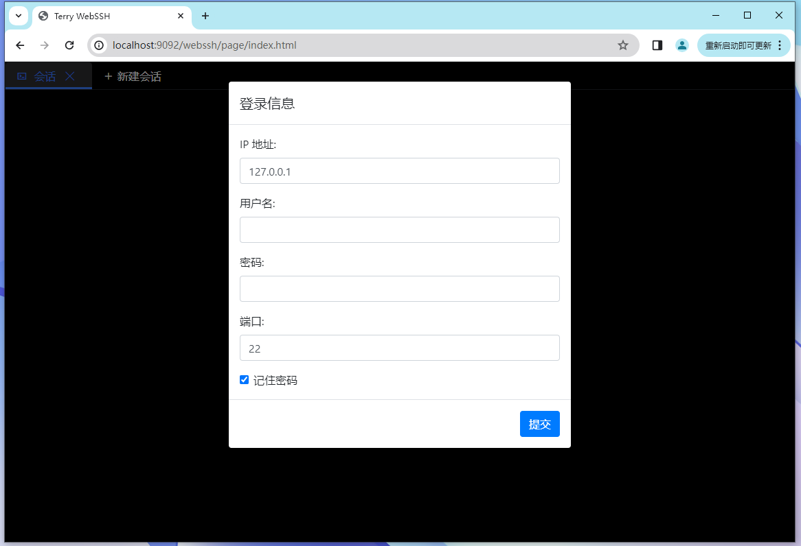
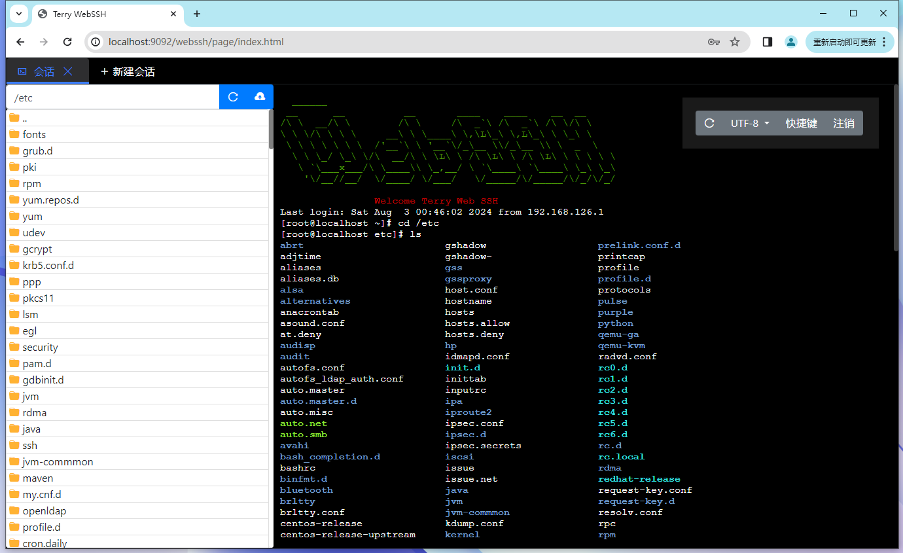
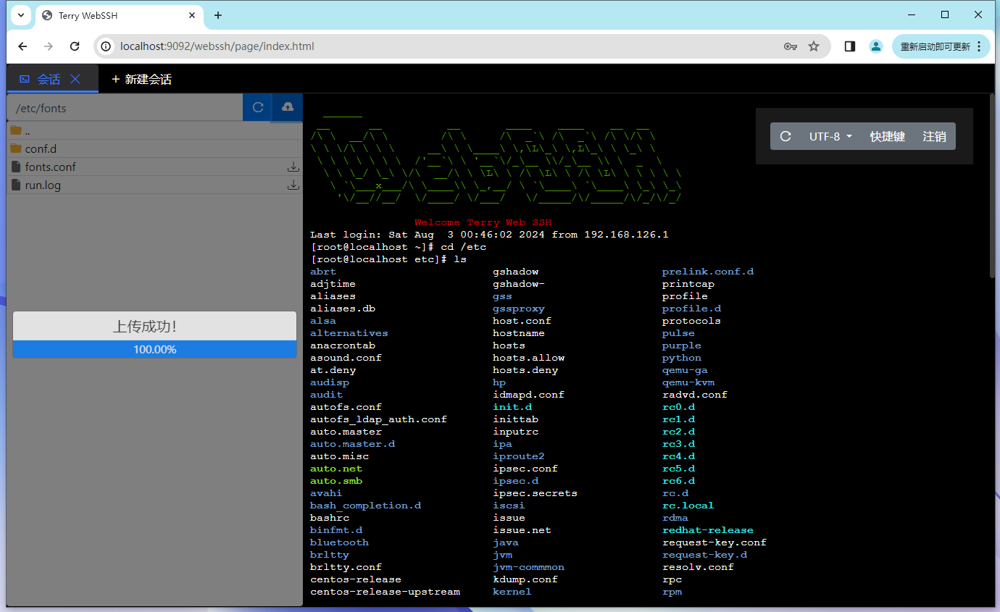
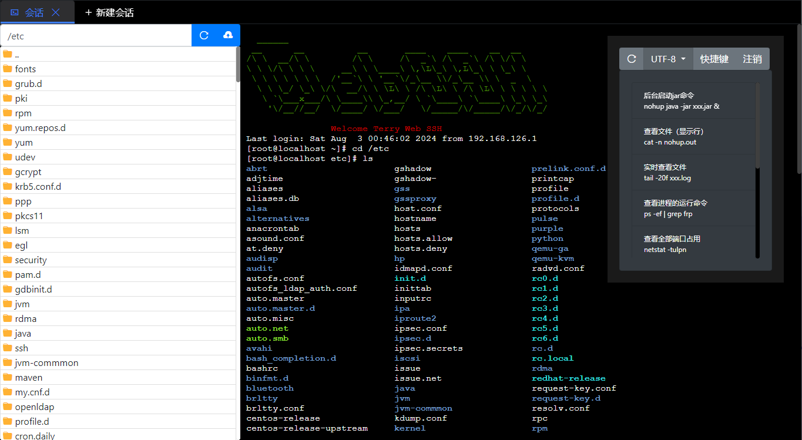

# webssh

## 介绍
WebSSH 是一个轻量级的开源ssh工具，只需安装在服务端，就可以通过浏览器访问SSH和FTP。它支持文件和日志高亮显示，Vim 和 Top 命令，实时查看日志，并且操作体验与标准的 Shell 基本相同。WebSSH 支持多会话、文件上传下载、编码切换（GBK、UTF-8），以及自定义快捷键。您可以通过 Starter 方式将其集成到 Spring Boot 项目中，或通过内部的 Iframe 集成到您的项目中。

## 技术
- Java
- Spring Boot
- WebSocket
- HTML
- xterm.js

## 特性

- 浏览器内 SSH 和 FTP 访问
- 支持文件和日志高亮显示
- 支持 Vim 和 Top 命令
- 实时查看日志
- 支持多会话
- 文件上传下载功能
- 支持编码切换（GBK、UTF-8）
- 自定义快捷键

## 项目功能

登录webssh

查看文件 以及命令行

上传服务器文件，下载文件

快捷键

## 使用
开启后在浏览器中打开 http://localhost:9092/webssh/page/index.html，即可使用 WebSSH。

## 后续迭代方向

- Go版本
- 前端改造成Vue3 + Vite