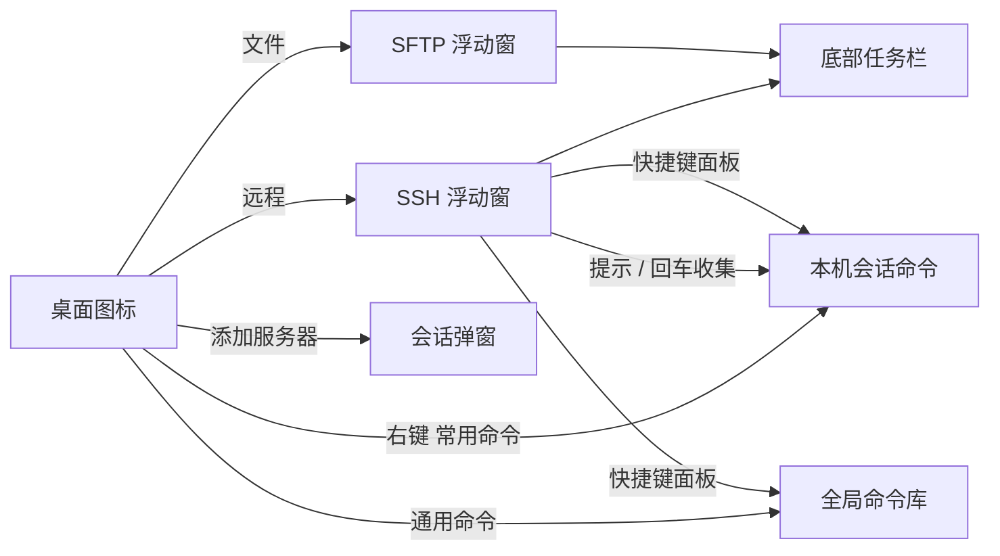
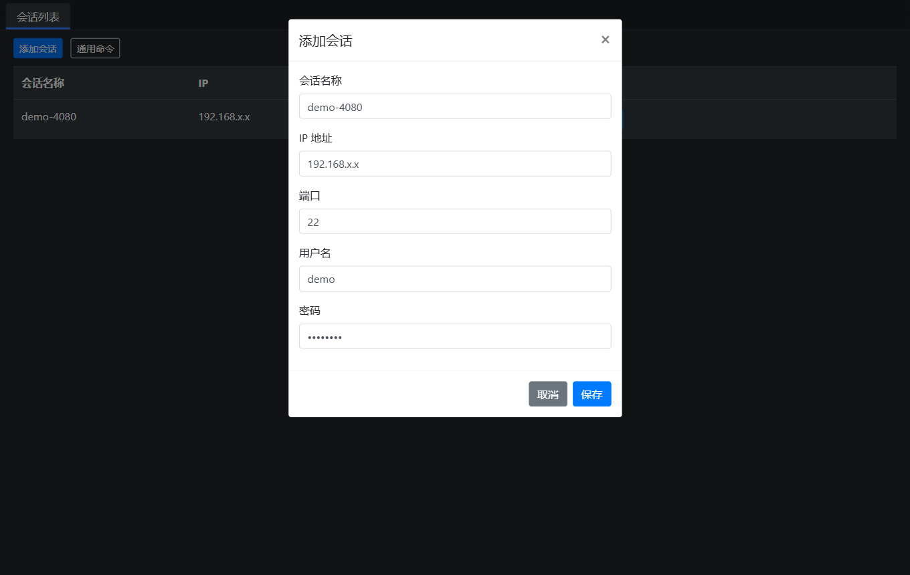
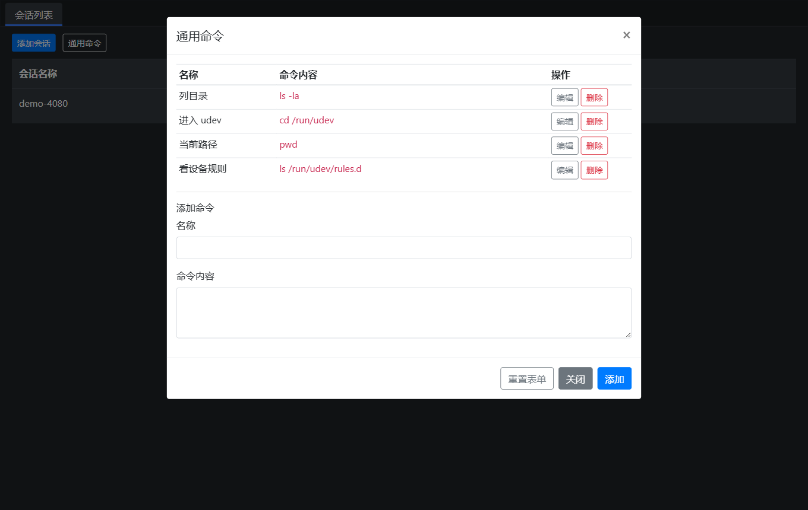
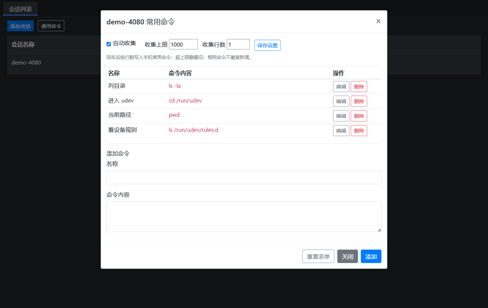
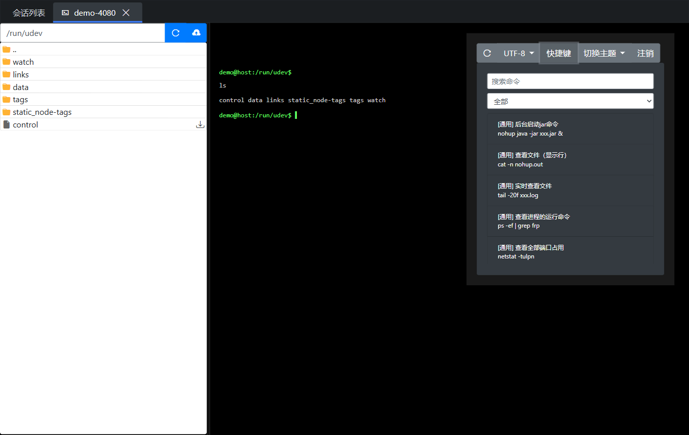
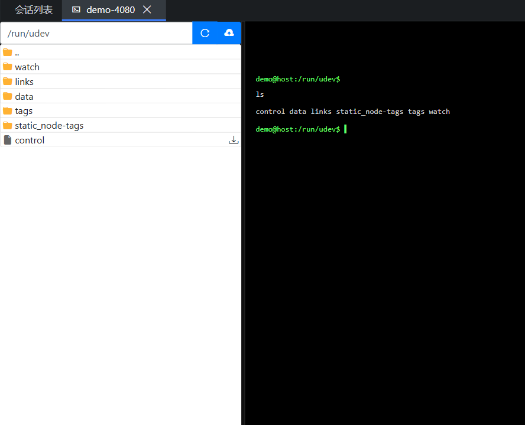
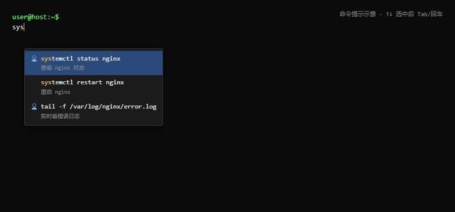
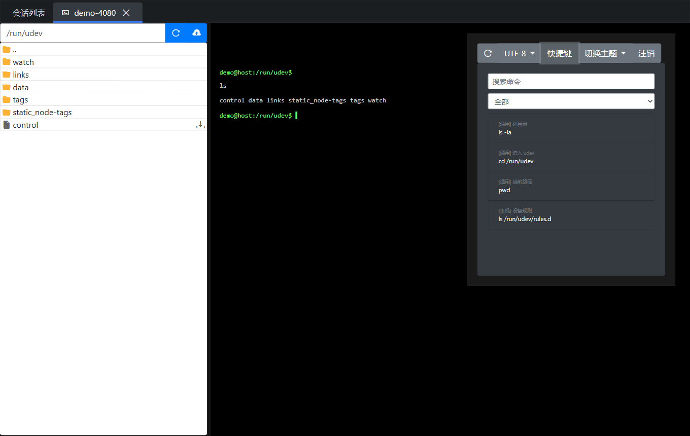

# WebSSH

浏览器里用的轻量 SSH / SFTP 工具：装在服务端即可通过页面连远程、管文件、跑终端。可独立运行，也可作为 Spring Boot Starter / iframe 嵌进现有项目。

入口：开启后打开 [http://localhost:9092/webssh/page/index.html](http://localhost:9092/webssh/page/index.html)

开发运行：

```bash
mvn spring-boot:run
```

默认端口 **9092**。

桌面化会话入口设计说明（父仓库）：`docs/superpowers/specs/2026-08-18-webssh-desktop-sessions-design.md`

---

## 技术栈

| 层 | 技术 |
|----|------|
| 后端 | Java、Spring Boot、WebSocket、JSch |
| 前端 | HTML / jQuery / Bootstrap、xterm.js |
| 数据 | 本地 JSON（`data/sessions.json`、`data/commands.json`） |

---

## 功能总览

### 基础能力

- 浏览器内 **SSH 终端**（xterm，体验接近标准 Shell）
- **SFTP 文件浏览**、上传 / 下载（独立浮动窗）
- Vim、Top、实时看日志等全屏类命令可用
- **编码切换**（UTF-8 / GBK 等），中文输入按连接编码写出，默认 UTF-8
- **桌面图标入口**：一台服务器一个图标；远程 / 文件以浮动窗 + 底部任务栏管理
- 终端侧 **快捷键面板**（来自通用 + 本机命令，可搜索、过滤）

### 近期增强（2026-08）

| 能力 | 说明 |
|------|------|
| 桌面首页 | 首页为桌面图标网格（添加服务器、通用命令、各服务器图标） |
| 远程 / 文件 | 单击服务器 → 菜单「远程」「文件」；默认以**浮动窗**打开 SSH / SFTP |
| ▤ 左侧多列停靠 | 远程与文件窗标题栏 ▤ → 进入左侧 dock strip，多窗从左到右，可拖分割条调宽；再点 ▤ 或拖出 strip 恢复浮动 |
| 边缘 Snap | 拖标题栏到左/右缘 → 半屏；拖到四角 → 四分之一；松手前半透明预览 |
| Win11 布局选择器 | 悬停最大化按钮弹出布局板（两栏、三栏、四格等），点格落入对应槽位 |
| Snap Assist | 占槽后若仍有空槽且存在其它已开窗，空区展示候选；点选填入，Esc / 点空白取消 |
| 布局持久化 | `localStorage['webssh.sessionLayout.v1']`；刷新后在登录态允许时恢复 dock / snap / float；已关闭的窗不复活 |
| 任务栏 | 浮动 / 停靠 / Snap 窗均显示在底部任务栏：左键聚焦 / 最小化；右键菜单：还原 / 最小化 / 最大化 / 关闭 |
| 右键菜单 | 服务器图标右键：修改 / 删除 / 常用命令 |
| 文件查看方式 | 文件区「预览窗格」：详细信息 / 大图标（图片缩略图） |
| 通用 / 本机命令 | 弹窗 CRUD；首次启动从 `dict.json` 导入通用命令 |
| 快捷键搜索过滤 | 全部 / 通用 / 本机 + 关键字 |
| IDEA 风格命令提示 | 输入时浮层提示；匹配字高亮；本机项带头像图标 |
| 提示交互 | 仅 **↑↓ 选中后** Tab/回车才作用于提示，避免抢 shell 补全 |
| 回车自动收集 | 按会话开关、上限（≤1000）、收集行数（1–50）写入本机命令 |

---

## 快速上手

1. `mvn spring-boot:run`
2. 浏览器打开首页（桌面图标，无会话表格）
3. 双击式入口：点 **添加服务器** → 填 IP / 端口 / 用户名 / 密码 → 保存
4. 单击服务器图标 → **远程** 打开终端浮动窗；或选 **文件** 打开文件浮动窗
5. 用底部任务栏切换 / 最小化窗口；需要分栏时点标题栏 **▤** 或拖标题栏到屏幕边缘 Snap
6. 刷新页面后，已保存的 dock / Snap / 浮动布局会自动恢复（会话仍有效时）
7. 关闭窗口**不会**注销 SSH、**不会**清除 `tagId`（可再开）；SSH 工具栏已无「注销」按钮


```mermaid
flowchart LR
  A[桌面图标] -->|远程| B[SSH 浮动窗]
  A -->|文件| C[SFTP 浮动窗]
  B --> D[底部任务栏]
  C --> D
  A -->|添加服务器| E[会话弹窗]
  A -->|通用命令| F[全局命令库]
  A -->|右键 常用命令| G[本机会话命令]
  B -->|提示 / 回车收集| G
  B -->|快捷键面板| F
  B -->|快捷键面板| G
```

---

## 界面与功能说明

> 下文截图为历史示例；当前主入口已改为桌面图标（截图中的表格 / 顶栏 Tab 不再作为主 UI）。

### 1. 桌面首页

首页为常驻桌面：图标网格自动排布。

| 图标 / 操作 | 作用 |
|------|------|
| 添加服务器 | 新建连接（名称、IP、端口、账号密码） |
| 通用命令 | 维护所有会话共用的命令库 |
| 服务器图标 · 单击 | 菜单：**远程**（SSH 窗）/ **文件**（SFTP 窗） |
| 服务器图标 · 右键 | **修改** / **删除** / **常用命令** |

添加会话表单：



> 会话密码明文写在 `data/sessions.json`，勿公网裸奔。

---

### 2. 通用命令 / 本机常用命令

**通用命令**：全会话共享，首次启动会从 `static/webssh/data/dict.json` 导入。桌面点 **通用命令** 打开。



**本机常用命令**：按会话隔离；服务器图标右键 → **常用命令**；弹窗顶部可配置自动收集。



| 设置项 | 默认 | 范围 | 含义 |
|--------|------|------|------|
| 自动收集 | 开 | 开/关 | 终端回车后是否写入本机命令 |
| 收集上限 | 1000 | 1–1000 | 超出则从尾部删最旧 |
| 收集行数 | 1 | 1–50 | 一次收集最多取前 N 行 |

规则摘要：

- 只写入当前会话的 `bySession`，不进通用库
- 与已有 `value`（trim）相同 → 更新时间并置顶，不重复新增
- 多行粘贴按「收集行数」截断后一次收集

**安全提示：** 开启自动收集时，终端键入内容（含密码、token）可能写入 `data/commands.json`。输入密钥前请先关闭自动收集。

---

### 3. 远程窗与文件窗

- **远程**：浮动窗内嵌 `ssh.html`（终端、编码、主题、快捷键、命令提示）
- **文件**：浮动窗内嵌 `sftp.html`（浏览、上传 / 下载、预览）；不与终端并排分栏
- 开文件请从桌面图标 → **文件**（终端工具栏不再提供「文件」主入口）
- 关闭浮动窗只移除窗口，**不**调用 logout / 清除 `tagId`；SSH 工具栏**已移除「注销」按钮**

#### 停靠、Snap 与布局恢复

| 操作 | 说明 |
|------|------|
| ▤ 多列停靠 | 标题栏 ▤ 进入左侧 strip；SFTP 内右键「停靠分栏」与 ▤ 同效 |
| 取消停靠 | 再点 ▤，或从 strip 标题栏拖出 → 恢复浮动 |
| 边缘 Snap | 拖标题栏到工作区左/右缘（半屏）或四角（四分之一）；与 ▤ 互斥 |
| 布局选择器 | 悬停最大化按钮 → Win11 式布局板；点格当前窗落入该槽 |
| Snap Assist | 占槽后空槽区列出其它已开窗；点选填入；Esc 取消 |
| 刷新恢复 | 键名 `webssh.sessionLayout.v1`；恢复 dock / snap / float 几何；不含密码 |



上传 / 下载：



编码：终端工具栏可切换（如 UTF-8 / GBK），连接时会同步到后端，避免中文乱码。

---

### 4. 任务栏与多窗

- 有打开的远程 / 文件窗时，桌面底部显示任务栏
- 每项：类型图标（终端 / 文件夹）+ 标题；左键切换聚焦与最小化；**右键**：还原 / 最小化 / 最大化 / 关闭（关闭不清 `tagId`）
- **浮动、左侧停靠、Snap** 三种状态的窗均出现在任务栏
- 同一服务器可多开远程窗或多开文件窗
- 旧顶部远程 Tab / 会话列表表格不再作为主入口

---

### 5. 终端命令提示（IDEA 风格）

输入时根据 **通用 + 本机** 命令弹出候选（示意）：



展示约定：

- **命令在上**（更醒目），中文名称在下
- **本机**命令左侧为用户小图标；通用命令无图标（占位对齐）
- 与当前输入匹配的片段高亮

| 按键 | 行为 |
|------|------|
| 输入 | 更新候选；未 ↑↓ 前不高亮选中项 |
| ↑ / ↓ | 选中并滚动保证可见；此后 Tab/回车才作用于提示 |
| Tab | 已选中 → 补全到终端（不回车）；未选中 → 交给 shell |
| 回车 | 已选中 → 补全并执行；未选中 → 正常回车 +（可选）自动收集 |
| Esc | 关闭提示 |
| 鼠标点选 | 直接补全该项 |

提示层靠近光标；靠近屏幕底部时会翻到光标上方。

---

### 6. 快捷键面板

终端侧快捷键列表对接命令 API，支持搜索与「全部 / 通用 / 本机」过滤，一点即可下发命令。



---

## 数据文件

| 文件 | 内容 |
|------|------|
| `data/sessions.json` | 会话列表（含密码） |
| `data/commands.json` | `global`、`bySession`、`sessionSettings` |
| `static/webssh/data/dict.json` | 通用命令种子（首次导入） |

`commands.json` 结构示意：

```json
{
  "global": [{ "id": "...", "name": "...", "value": "...", "updatedAt": "..." }],
  "bySession": {
    "<sessionId>": [{ "id": "...", "name": "...", "value": "...", "updatedAt": "..." }]
  },
  "sessionSettings": {
    "<sessionId>": {
      "autoCollect": true,
      "collectLimit": 1000,
      "collectLines": 1
    }
  }
}
```

---

## 主要 API（摘要）

| 方法 | 路径 | 说明 |
|------|------|------|
| CRUD | `/webssh/api/sessions` | 会话增删改查 |
| CRUD | `/webssh/api/commands/...` | 通用 / 本机命令 |
| GET | `/webssh/api/commands/for-session/{id}` | 终端提示用：`{ global, session }` |
| GET/PUT | `/webssh/api/commands/settings?sessionId=` | 自动收集设置 |
| POST | `/webssh/api/commands/collect` | 回车收集（尊重开关与行数） |

WebSocket：终端输入输出；`operate: encoded` 切换远端编码。

---

## 集成方式

- **独立运行**：本仓库 `mvn spring-boot:run` 或发行包脚本
- **Spring Boot Starter**：引入依赖后挂载静态页与 WebSocket
- **iframe**：将 `/webssh/page/index.html`（或终端页）嵌到业务系统

---

## 发行版

| 包 | 说明 |
|----|------|
| `webssh.zip` | 需本机已装 JDK |
| `webssh_win64.zip` | 内置 Windows JDK，解压后 `run.bat` |
| `webssh_mac64.zip` | 内置 macOS JDK，解压后按说明启动 |

脚本：Linux `client.sh`，Windows `run.bat`，macOS `client-mac.sh`。

---

## 安全注意

1. 会话密码明文存 JSON，仅建议内网 / 本机使用  
2. 自动收集可能记下敏感输入 → 输密码前关「自动收集」  
3. 勿将 `data/` 提交到公开仓库或暴露到公网  

---

## 后续方向

- Go 版本
- 前端改造为 Vue3 + Vite

---

## 许可

见 [LICENSE](LICENSE)。
