# WebSSH

**在浏览器里管服务器：SSH 终端 + SFTP 文件，开箱即用。**

不装客户端、不切窗口。加一台机器，点一下就能开远程终端或文件窗；多窗停靠、Snap、任务栏，用起来像桌面。


[快速开始](#快速开始) · [功能亮点](#功能亮点) · [怎么用](#怎么用) · [远程详解](#远程ssh详解) · [服务器监控](#服务器监控详解) · [文件窗详解](#文件资源管理器详解) · [窗口布局](#窗口布局详解) · [命令库](#命令库详解) · [快捷键](#快捷键) · [安全注意](#安全注意)

---

## 为什么选它


|               |                                           |
| ------------- | ----------------------------------------- |
| **零客户端**      | 浏览器打开就能连，适合跳板机 / 内网运维台                    |
| **终端 + 文件一体** | SSH 与 SFTP 分窗并行；终端也可拖文件上传                 |
| **类资源管理器**    | 地址栏、目录树、收藏、多视图、悬浮详情、预览窗格                  |
| **桌面化多窗**     | 浮动、左侧停靠、边缘 Snap、布局板、任务栏；布局与目录会记住          |
| **命令库**       | 通用 + 本机命令；可一键导入约 1000 条常见运维命令；侧栏发送 + 输入提示 |
| **任务管理器**     | 每台服务器一个独立监控窗；**可同时开多台**并排看进程 / 性能 / GPU |
| **磁盘扫描**       | TreeSize 风格：大小扫描、停止、底部真实磁盘表；与终端按目录互开 |
| **好集成**       | 独立运行，或 Spring Boot Starter / iframe 嵌入    |


---


## 功能亮点


### 桌面入口

一台服务器一个图标。单击 → **远程** / **文件** / **服务器监控**；右键 → 修改、删除、常用命令。

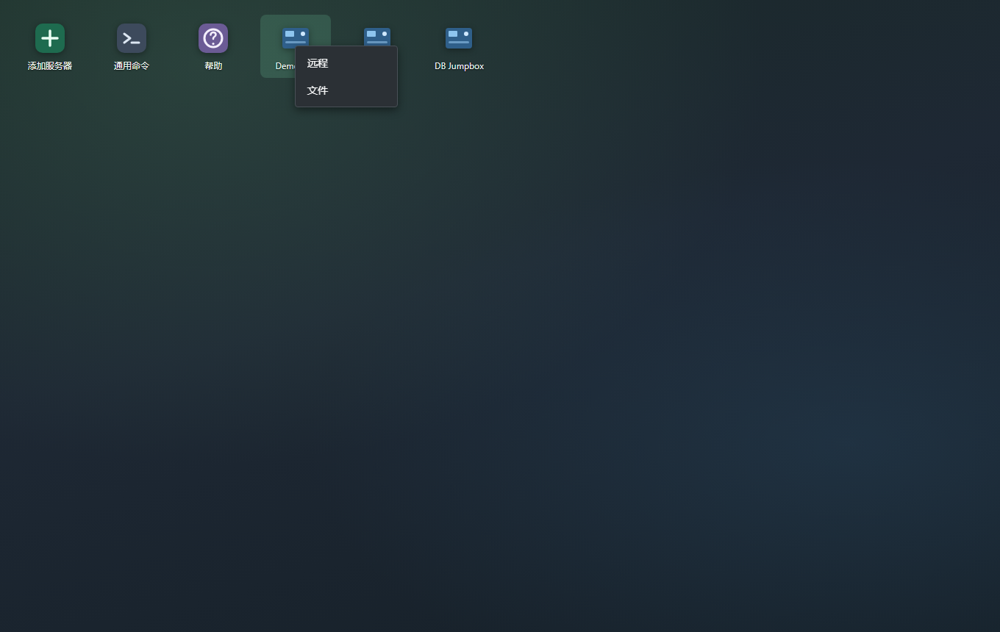

添加连接（下图为演示数据；当前仅支持 **密码登录**，无私钥表单）。弹窗为 **Windows 11** 风格圆角表单：


### 类 Windows 的文件窗

面包屑、快速访问、目录树、详细信息（含权限 / 所有者）。工具栏含 **磁盘空间扫描**、**打开终端**；点扫描后左侧底部出现 **磁盘使用空间** 表：

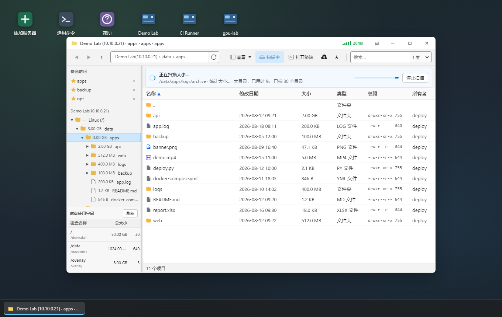

大图标 + **悬浮详情**：

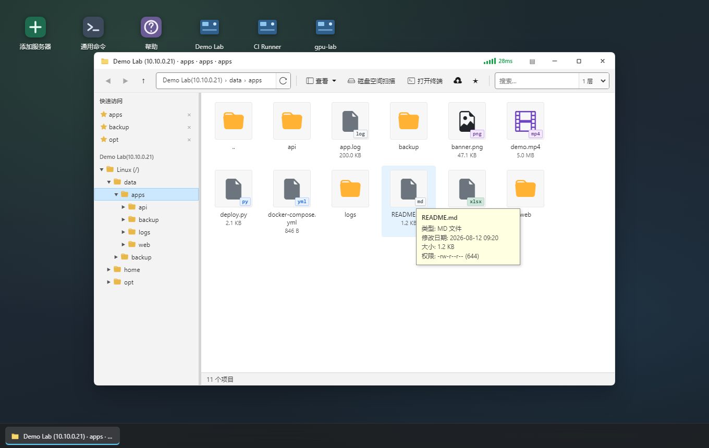

终端与文件可按 **同一目录** 互开（终端工具栏「文件管理」↔ 文件窗「打开终端」）：

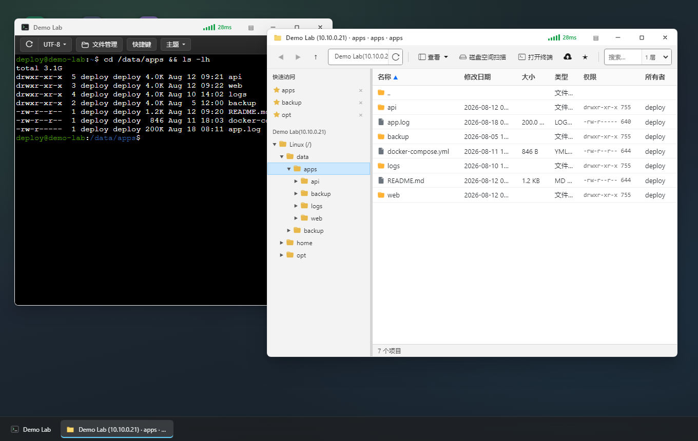

双击或空格即可预览：**图片 / 视频 / 文本（含** `.py`**） / Excel**，盖在桌面上，不打断其它窗口。详见 [预览与在线编辑](#预览与在线编辑)。

### 通用命令库


### 应用内帮助

桌面点 **帮助** → 打开 **帮助浮动窗**（渲染本 README；已打开则聚焦；帮助窗 **不可停靠**）：


### 窗口与布局

- **▤ 左侧多列停靠** + 拖分割条调宽  
- **边缘 Snap**（半屏 / 四角）+ **布局板**（左右 / 上下 / 四格 / 左一右二）  
- **Snap Assist**、**任务栏**、**刷新恢复布局与文件目录**


### 服务器监控（任务管理器）

单击服务器 → **服务器监控**，打开类 Windows 的任务管理器：进程、性能、端口。

**每台服务器一个独立窗口，可以同时开多台。** 排查集群或对比两台机器时，把两个任务管理器并排放着看，不用来回切会话。

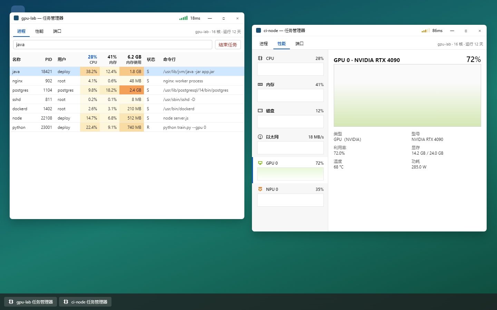

进程表带热力着色和表头实时总量；性能页左侧缩略图、右侧大图，有 NVIDIA GPU / 算能 NPU 时会出现在列表里；端口页列出当前监听。详见 [服务器监控详解](#服务器监控详解)。

会话窗标题栏有 **五格信号 + 延迟**；终端里 **Ctrl+F** 可在会话输出中查找（高亮跟着内容滚）。

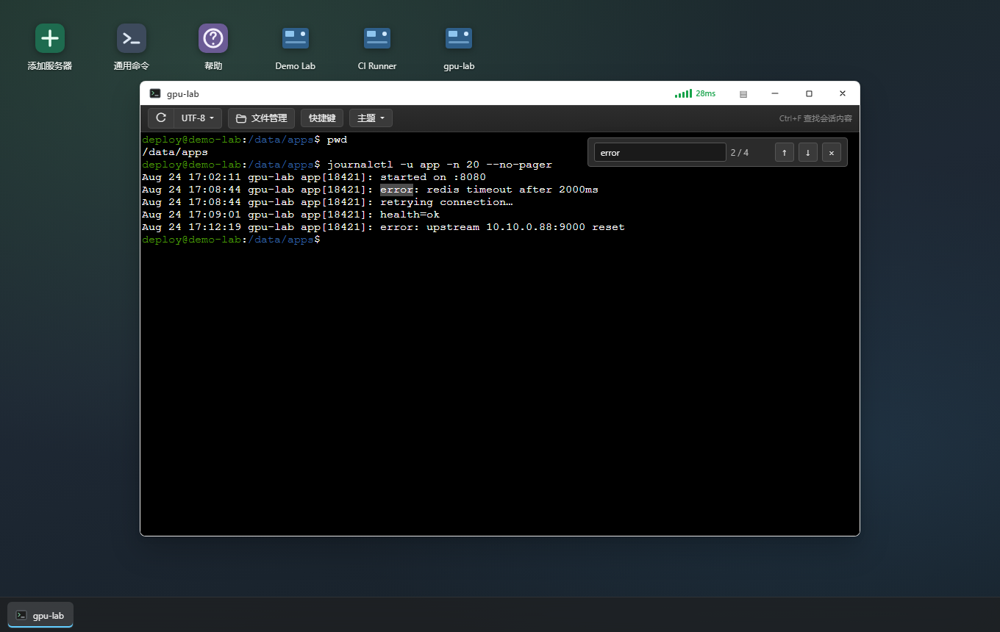

---


## 快速开始

```bash
cd tools/webssh   # 若在 monorepo 中
mvn spring-boot:run
```

浏览器打开：`http://localhost:9092/webssh/page/index.html`（默认端口 **9092**）

1. **添加服务器** → 保存
2. 单击图标 → **远程** / **文件** / **服务器监控**
3. 任务栏切换窗口；需要分栏时点标题栏 **▤**、拖到边缘，或悬停最大化用布局板

发行包：`webssh.zip`（需 JDK）、`webssh_win64.zip` / `webssh_mac64.zip`（内置 JRE）。

---


## 怎么用


### 桌面


| 操作       | 说明                          |
| -------- | --------------------------- |
| 添加服务器    | 名称、IP、端口、用户名、**密码**         |
| 通用命令     | 全局命令库 CRUD                  |
| 帮助       | 打开帮助浮动窗（读本 README）          |
| 服务器 · 单击 | **远程** / **文件** / **服务器监控** |
| 服务器 · 右键 | 修改 / 删除 / 常用命令              |


开远程、文件或监控时会校验登录态：过期则 **自动重新 login**，减少「会话已过期」打断。登录缓存按**会话 + 账号密码**校验：修改服务器用户名/密码后，新开窗口会 **强制用新凭据重登**，不会继续用旧连接。

**服务器监控**（类 Windows 任务管理器）：进程列表（可搜索、排序、结束任务）、CPU/内存/磁盘/网络性能曲线、监听端口占用。约每 2 秒刷新；需 Linux 目标机（读 `/proc`、`ps`、`ss`）。

**可同时打开多台服务器的任务管理器。** 每台机器一个窗口，互不抢会话，适合并排对比 CPU、内存、GPU。

### 远程 / 文件 / 命令 / 监控（入口）

详见下文专章：**[远程 SSH 详解](#远程ssh详解)**、**[服务器监控详解](#服务器监控详解)**、**[文件资源管理器详解](#文件资源管理器详解)**、**[命令库详解](#命令库详解)**、**[窗口布局详解](#窗口布局详解)**。

关闭浮动窗 **不会** 注销后台 SSH，也不会清除本地登录标记，可再开继续用。

---


## 远程（SSH）详解


### 基本能力

- xterm 终端，可用 vim、top、跟日志等全屏程序  
- **顶部固定工具栏**（类 Windows）：刷新连接、编码、**文件管理**、快捷键、主题；快捷键从顶栏展开，不浮在终端上  
- **文件管理**：按 shell 当前目录（`/pwd`）**新开**文件窗；与文件窗里的「打开终端」互相对应  
- 终端占满工具栏以下全部宽高；连接与窗口缩放时会把 **cols/rows 同步到远端 PTY**（避免 `nvidia-smi` 等宽表错位换行）  
- 快捷键面板：搜索 +「全部 / 通用 / 本机」过滤，点击即发到终端  
- 面板与输入提示共用同一套命令数据  
- 会话窗标题栏显示 **五格信号 + 延迟**（如 `22ms`）：绿 ≤80ms、黄 ≤250ms、红更慢；约每 6 秒探测一次 SSH 往返  
- **Ctrl+F** 在会话输出中查找（类 Xshell）：黄底高亮命中，**跟着终端内容一起滚**；Enter / F3 下一个，Shift+Enter / Shift+F3 上一个，Esc 关闭


### 编码与主题


| 项   | 选项                                    |
| --- | ------------------------------------- |
| 编码  | **UTF-8**（默认）、**GBK**；切换会同步到后端，减轻中文乱码 |
| 主题  | **暗黑**、**深蓝**、**白色**、**绿色**（记在浏览器本地）  |


### 拖文件到终端上传

把本地文件 **拖进终端区域**，会上传到 **shell 当前工作目录**（通过 `/pwd` 探测）：

- 同名冲突：可 **重命名 / 替换 / 跳过**  
- 成功后有短提示

不必先开文件窗也能丢配置、脚本上去。

### IDEA 风格命令提示

输入时根据通用 + 本机命令弹出候选：


| 行为    | 说明                              |
| ----- | ------------------------------- |
| 匹配高亮  | 与当前输入重合的片段高亮                    |
| 来源区分  | 本机项可带头像/图标，通用项对齐占位              |
| ↑ / ↓ | 选中候选（未选中前 Tab/回车不抢 shell）       |
| Tab   | 已选中 → 补全到终端（不回车）；未选中 → 交给 shell |
| 回车    | 已选中 → 补全并执行；未选中 → 正常回车（可触发自动收集） |
| Esc   | 关闭提示                            |
| 鼠标点选  | 直接套用该项                          |
| IME   | 中文输入法组字期间不误触发提示/收集              |
| 多行粘贴  | 按「收集行数」截断后可一次收集                 |


### 关窗与重连

- 关窗只移除 UI，后台会话可保留  
- 再次打开会探测登录是否仍有效，失效则自动重登

---

## 服务器监控详解

从桌面单击服务器 → **服务器监控**。每个窗口对应一台已登录的 Linux 机器，和远程 / 文件窗一样可以浮动、停靠、Snap。

### 同时监控多台

这是最常用的用法：**给每台机器各开一个任务管理器，并排放着看。**

- 窗口互不影响，不会抢同一条 SSH 会话  
- 标题栏同样有五格信号和延迟，一眼看出哪台卡、哪台通  
- 适合对比负载、查哪台 GPU 打满、哪台端口被占


### 进程

类似 Windows 任务管理器的进程页：

- 可按进程名 / 命令 / PID / 用户 **筛选**  
- 点表头 **排序**（默认按 CPU）  
- 表头钉在顶部，并显示整机 **CPU / 内存 / 内存使用** 实时总量  
- CPU、内存、内存使用格子按数值 **热力着色**，占用高的一眼能看见  
- 选中一行后可 **结束任务**  
- 进程 CPU 按 `/proc/[pid]/stat` 两次采样算即时占用（不是 `ps` 的启动以来平均）

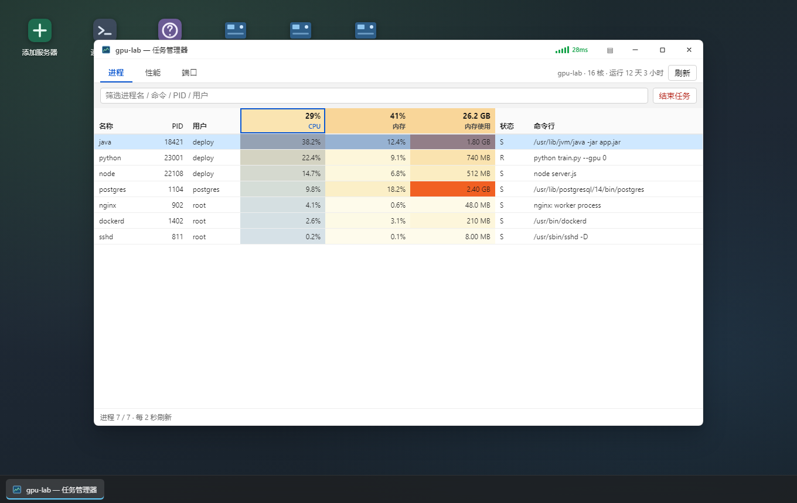

### 性能

左侧缩略图（CPU、内存、磁盘、以太网，以及 GPU / NPU）每项左侧带 **图标**，右侧大图 + 数字，布局接近 Windows 任务管理器「性能」页。

有加速器时会自动出现在左侧列表：

| 类型 | 来源 | 显示 |
|------|------|------|
| **GPU（NVIDIA）** | `nvidia-smi` | 利用率、显存、温度、功耗 |
| **NPU（算能）** | sysfs / `bm-smi` | 利用率、设备内存、温度 |

约每 2 秒刷新。

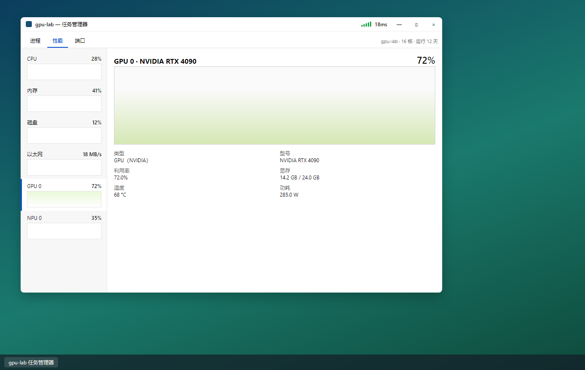

### 端口

当前 **监听端口**：协议、本地地址、PID、进程名。可搜索、点表头排序。部分系统需 root 才能看到进程名。

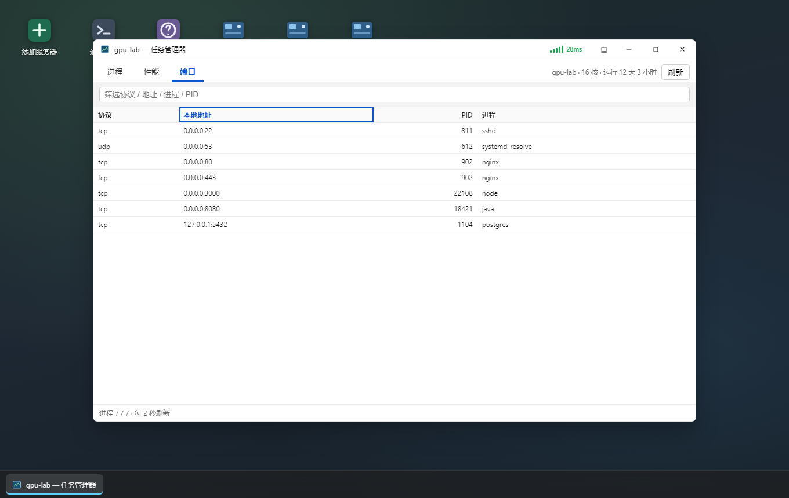

### 条件

目标机需 Linux（读 `/proc`、`ps`、`ss`）。采集走已登录的 SSH 会话。

---

## 文件资源管理器详解

从桌面 → **文件** 打开。习惯上接近 Windows 资源管理器，同时面向 Linux 路径与权限。

### 整体布局


| 区域        | 作用                                             |
| --------- | ---------------------------------------------- |
| 顶部导航      | 后退 / 前进 / 上级；面包屑；刷新；查看；**磁盘空间扫描**；**打开终端**；上传；收藏；搜索 |
| 左侧 · 快速访问 | ★ 收藏目录（按**服务器会话**隔离）；侧栏与文件区之间可 **拖动调宽**（宽度会记住） |
| 左侧 · 目录树  | 展开远程树；扫描后名称前显示大小，并列出文件；可把文件 **拖到树节点** 做复制/移动 |
| 左侧 · 磁盘表  | 点「磁盘空间扫描」后出现：真实磁盘名称 / 总大小 / 已用 / 剩余 / % 可用（过滤 tmpfs 等） |
| 中间列表      | 多视图；框选 / 多选；底部状态栏「N 个项目」；选中时追加「选中了 X 个项目」 |
| 父页预览层     | 图片 / 视频 / 文本 / Excel 预览（盖在桌面上）                 |


窗口标题：根目录为 `会话名 (ip)`，进入子目录为 `会话名 (ip) · 末级名`。  
面包屑 / 树根文案为 `会话名(ip)`（不再叫「此电脑」）。

### 地址栏与导航

- 面包屑：`会话名(IP) › data › apps`  
- 单击地址栏空白编辑，**回车** 跳转，**Esc** 取消；**Ctrl+L** 聚焦  
- **Alt+← / →**、**Backspace / Alt+↑**  
- 首屏：URL 预置 `cwd` 优先；否则先 `/`，再异步对齐 shell pwd，**避免一上来进无权限的** `/root`  
- 刷新页面尽量 **回到上次目录**（布局里会存每个文件窗的 `cwd`）

### 磁盘空间扫描（整棵子树）

工具栏 **磁盘空间扫描**（硬盘图标）默认关闭。第一次点开后：

- 从**当前目录**后台递归统计（类似 TreeSize）：先列子目录再 `du`，兼容 BusyBox / 算能等设备  
- 顶部进度条显示当前路径、阶段（列出子目录 / 统计大小）、已用时、已扫目录数；可点 **停止扫描**（保留已统计结果）  
- **不会**因进入子目录再扫一遍；跳过 `/proc` `/sys` `/dev` `/run`；命令带 `nice` 与超时，避免卡死在超大目录（如 `/data/offline`）  
- 左侧树在名称前显示大小，并列出文件  
- 同时在左侧底部展开 **磁盘使用空间**：名称（挂载点 + 设备）、总大小、已用、剩余、% 可用；保留 `overlay` 根分区（算能常见）；点击行可跳到该挂载点  
- 再点一次按钮可关闭扫描显示（缓存仍保留）


### 打开终端（按当前目录）

工具栏 **打开终端**（终端图标）：为**同一台服务器新开** SSH 窗，连接后自动 `cd` 到文件窗当前路径。

终端侧对称能力：工具栏 **文件管理** → 按 shell `pwd` 新开文件窗。


### 查看方式


| 模式              | 说明                         |
| --------------- | -------------------------- |
| 详细信息            | 名称、修改日期、大小、类型、权限、所有者；点表头排序 |
| 内容              | 左图标 + 右侧摘要行                |
| 平铺 / 大图标 / 超大图标 | 网格；图片缩略图；视频也可抽帧缩略（见下）      |


- **Ctrl+滚轮**：详情 ↔ 图标缩放  
- **视图、排序、图标缩放** 会记在 `localStorage`  
- 图标视图下文件可带 **扩展名彩色角标**

缩略图上限（约）：图片 **5MB**；视频抽帧 **80MB**。

### 悬浮详情

大图标 / 平铺 / 超大图标下悬停：名称、类型、修改日期、大小、权限等。

### 选择与重命名

- 空白处拖拽 **框选**；Ctrl 跳选；Shift 范围选  
- 单击 **已选中项的名称** 稍候可进入重命名（类资源管理器）  
- **F2** 重命名；点输入框以外任意处结束编辑（有改动则提交）；**Esc** 取消；**Ctrl+Z** 可撤销最近一次重命名（支持时）


### 预览与在线编辑

在文件窗中 **双击** 或选中后按 **空格** 打开预览（盖在桌面之上）；**Esc** 或点「关闭」退出。预览走 `/webssh/api/preview`（视频支持 **Range** 拖进度）。


| 类型    | 扩展名（摘要）                                                          | 预览上限（约）              |
| ----- | ---------------------------------------------------------------- | -------------------- |
| 图片    | png / jpg / gif / webp / bmp / ico / svg                         | 8MB                  |
| 视频    | mp4 / webm / ogg / m4v / mov 等                                   | 512MB（Range）         |
| 文本    | txt / log / md / json / xml / yaml / sh / **py** / js / java / … | 8MB                  |
| Excel | xlsx / xlsm / xls（浏览器 SheetJS）                                   | 5MB；最多约 500 行 × 50 列 |


#### 图片预览

适合看截图、示意图、图标等。支持：

- 滚轮按鼠标位置 **放大 / 缩小**  
- **拖拽平移**；双击在「适应窗口 / 1:1」间切换  
- 顶栏：`−` `+`、`适应`、`1:1`；快捷键 `+`/`-`、`0`（适应）、`1`（原尺寸）

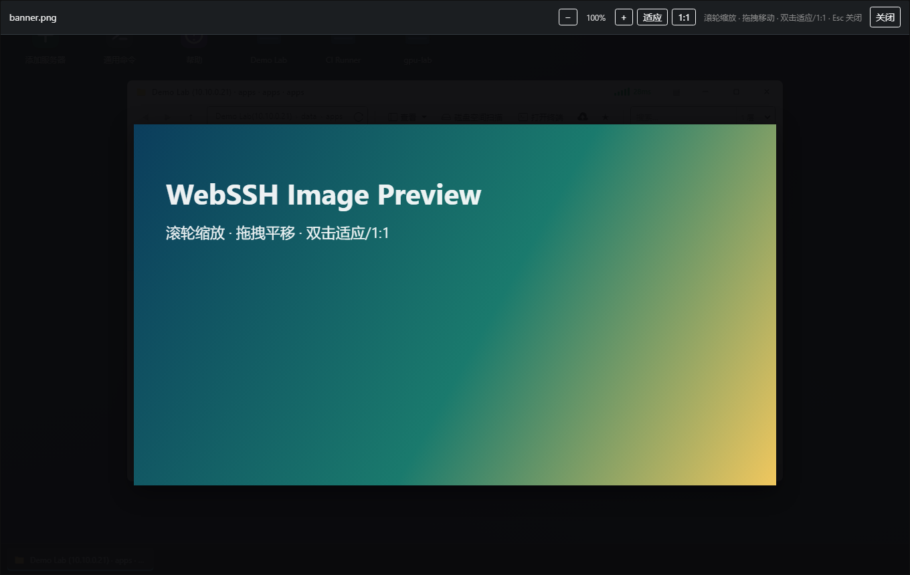

#### 视频预览

大文件可边下边播（Range）；浏览器原生控件 + 空格暂停/播放。编码不被浏览器支持时会提示，可改为下载后本地打开。大图标视图下还会尝试 **抽帧缩略图**（约 80MB 内）。

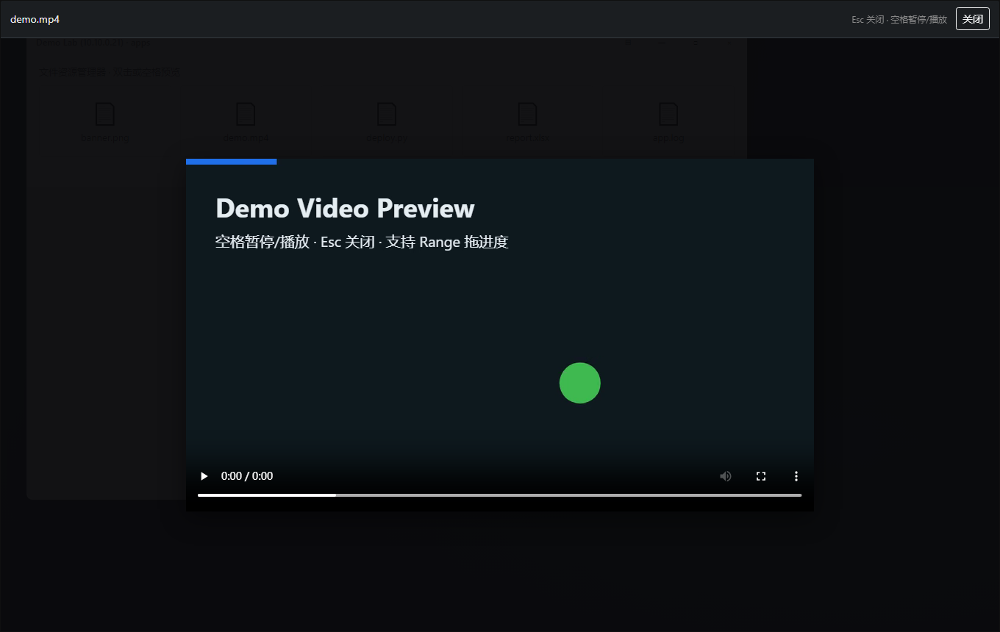

#### 文本 / Python 等代码预览

`.txt`、`.log`、`.md`、`.json`、`.yml`、`.sh`、`.py`、`.js`、`.java` 等按纯文本展示（等宽字体）。可在预览后改用右键 **编辑** 写回远程（仅文本类；超约 8MB 拒绝保存）。

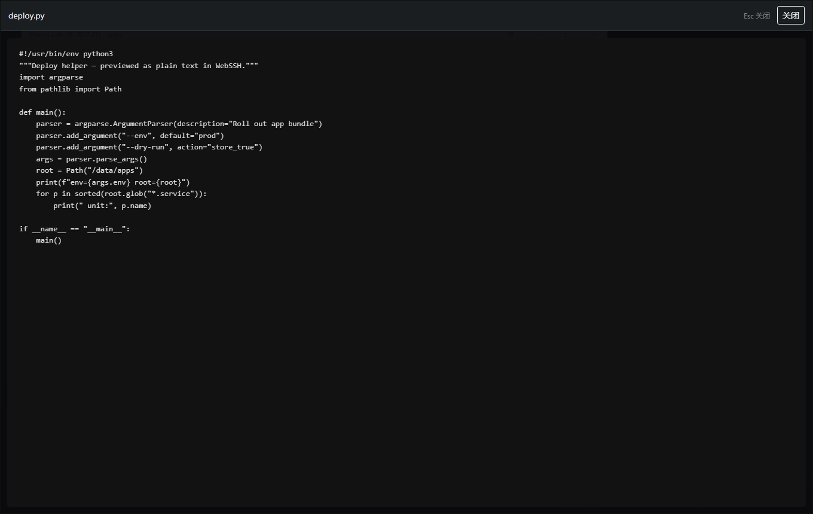

#### Excel 预览

`.xlsx` / `.xlsm` / `.xls` 在浏览器内用 SheetJS **只读** 解析：多 sheet 页签切换、行列统计；过大或超行列会截断并提示。**不支持**在线改表写回。

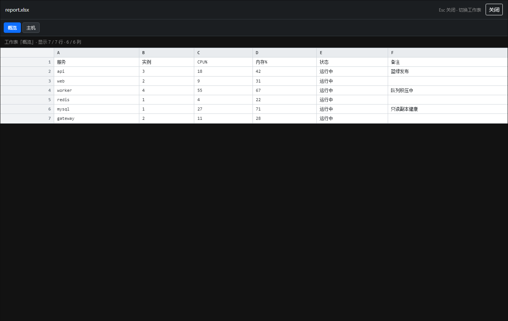

#### 其它说明

- **暂不支持**：PDF、DOC/DOCX（可下载后本地打开）  
- 预览层与文件窗分离：关掉预览不影响已打开的远程 / 文件窗口


### 上传 / 下载

- 工具栏上传，或拖进文件窗；也可拖到 **目录树节点** / 文件夹行  
- 进度弹层：**当前文件** + **合计**  
  - 阶段文案：**传到本机** → **写入远程**（服务端 NDJSON）
- 同名冲突：**重命名 / 替换 / 跳过**  
- 右键下载


### 剪贴板与拖拽


| 场景             | 行为                              |
| -------------- | ------------------------------- |
| Ctrl+C / X / V | 同会话复制 / 剪切 / 粘贴                 |
| 同服务器拖拽         | 默认 **复制**；**Shift** = **移动**    |
| 跨服务器拖到另一文件窗    | 仅 **复制**；服务端中转                  |
| 跨服进度           | 「跨服务器复制」+ 当前文件字节 + 合计 + 约 N 个文件 |
| 同服复制撞名         | 自动 `name - 副本.ext` / `(2)`…     |


### 压缩 / 解压 / 权限 / 属性


| 功能       | 说明                                                         |
| -------- | ---------------------------------------------------------- |
| **压缩**   | 右键压缩选中项；优先 **zip**，环境无 zip 则 **tar.gz**；可改归档名 |
| **解压到…** | 右键 zip / tar / tar.gz / tgz / gz；默认解到 **当前目录/压缩包名**；大弹窗显示目标路径与当前文件 |
| **修改权限** | 所有者 / 组 / 其他人 rwx 勾选，与八进制输入同步                              |
| **属性**   | 名称、类型、路径、大小、时间、权限、所有者、组等                                   |
| **复制路径** | 复制远程绝对路径                                                   |


### 右键菜单

空白处：刷新、新建文件夹/文件、上传、粘贴、收藏、停靠分栏…  
选中项：打开、编辑、下载、剪切复制粘贴、重命名、删除、压缩、解压到…、chmod、属性、复制路径…  


### 搜索

- 按文件名搜索；「层数」1–5 为向下递归深度（1 = 仅当前目录）


### 其它反馈

收藏、剪贴板、压缩、保存等操作有短 **toast** 提示。

内容视图示意：


---


## 窗口布局详解


### 浮动窗

- 拖标题栏移动；**四边 + 四角**均可拖拽改尺寸（最大化 / 停靠 / Snap 时隐藏）  
- **点击窗口任意区域**（含终端 / 文件内容）即可置顶激活（未激活时有透明遮罩）  
- **标题栏双击** = 最大化 / 还原  
- 新窗 **级联错位** 打开，减少完全重叠  
- 标题按钮接近 Win11：最小化 / 最大化（还原）/ 关闭（悬停变红）


### ▤ 左侧停靠

- 点标题栏 **▤**（或文件窗右键「停靠分栏」）进入左侧多列  
- 窗之间 **拖分割条** 调宽  
- 再点 ▤，或把标题栏拖出停靠区 → 恢复浮动


### 边缘 Snap

- 拖到工作区 **左 / 右缘** → 半屏  
- 拖到 **四角** → 四分之一  
- 松手前有半透明预览


### 布局板（悬停最大化）

悬停标题栏 **最大化** 约 0.3s，弹出 Win11 风格布局板：


| 模板   | 说明             |
| ---- | -------------- |
| 左右   | 两列             |
| 上下   | 两行             |
| 四格   | 四等分            |
| 左一右二 | 左侧一整列 + 右侧上下两格 |


点击格子把当前窗放入对应槽位。

### Snap Assist

占槽后若还有空槽且存在其它已开窗，空区列出候选；点选填入；**Esc** 或点空白取消。

### 任务栏

- 浮动 / 停靠 / Snap 窗都会出现  
- 左键：聚焦 / 最小化  
- 右键：**还原 / 最小化 / 最大化 / 关闭**


### 刷新后恢复

- 键名：`localStorage['webssh.sessionLayout.v1']`  
- 恢复：几何、dock / snap、**文件窗 cwd**、布局模板等  
- **已关闭的窗不会复活**；帮助窗不写入布局

---


## 命令库详解


| 类型   | 入口           | 说明                 |
| ---- | ------------ | ------------------ |
| 通用命令 | 桌面「通用命令」     | 全会话共享；可维护名称 + 命令内容 |
| 本机命令 | 服务器右键 → 常用命令 | 按会话隔离              |


侧栏快捷键与终端输入提示都读：`/webssh/api/commands/for-session/{id}`。

弹窗高度限制在窗口内：**只有命令列表滚动**，搜索栏、分页和底部添加表单保持固定。支持按名称/内容 **搜索**、表头 **排序**、以及 **分页**（10/20/50/100 条）。

### 导入常见命令

通用命令 / 本机命令弹窗左下角有 **导入常见命令**：从内置种子 `dict.json`（约 **1000** 条运维常用命令，如查看 MAC、端口、Docker、systemd 等）**合并导入**；已存在的相同命令内容会跳过，不会重复。

也可调用：`POST /webssh/api/commands/import-common?scope=global|session&sessionId=`。

### 本机命令 · 自动收集设置

在本机命令弹窗顶部可配置：


| 项    | 默认   | 范围     | 含义                |
| ---- | ---- | ------ | ----------------- |
| 自动收集 | 开    | 开/关    | 终端回车后是否写入本机命令     |
| 收集上限 | 1000 | 1–1000 | 超出则从尾部删最旧         |
| 收集行数 | 1    | 1–50   | 一次最多取前 N 行（多行粘贴时） |


规则摘要：

- 只写入当前会话，不进通用库  
- 与已有命令内容（trim）相同 → 更新时间并置顶，**不重复新增**  
- 输入密码 / token 前请先 **关闭自动收集**

> 说明：首次无 `data/commands.json` 时也会从 `static/webssh/data/dict.json` 自动灌入通用命令；已有数据时用弹窗「导入常见命令」合并即可。种子可用 `scripts/gen_common_commands.py` 重新生成。

---


## 快捷键


### 文件窗（焦点在文件区，且不在输入框）


| 快捷键               | 功能                   |
| ----------------- | -------------------- |
| F5                | 刷新                   |
| F2                | 重命名（点外部提交/结束；Esc 取消） |
| Delete            | 删除                   |
| Enter             | 打开                   |
| Backspace / Alt+↑ | 上级                   |
| Alt+← / Alt+→     | 后退 / 前进              |
| Ctrl+L            | 编辑地址栏                |
| Ctrl+A            | 全选                   |
| Ctrl+C / X / V    | 复制 / 剪切 / 粘贴         |
| Ctrl+Z            | 撤销重命名（若可）            |
| Ctrl+Shift+N      | 新建文件夹                |
| 空格                | 预览开/关（视频预览时为暂停/播放）   |
| Esc               | 关菜单 / 预览 / 取消编辑      |
| 图片预览 · 滚轮 / + −   | 放大缩小                 |
| 图片预览 · 0 / 1      | 适应窗口 / 原始大小          |
| ↑ / ↓             | 移动选中                 |
| Shift / Ctrl + 点击 | 范围选 / 跳选             |
| Shift + 拖拽        | 同服务器移动               |
| Ctrl + 滚轮         | 详情 ↔ 图标缩放            |
| Shift+F10 / 菜单键   | 右键菜单                 |


地址栏：**回车** 跳转，**Esc** 取消。

### 桌面与窗口


| 快捷键   | 功能                   |
| ----- | -------------------- |
| Esc   | 关桌面菜单；取消 Snap Assist |
| 标题栏双击 | 最大化 / 还原             |
| 任务栏右键 | 还原 / 最小化 / 最大化 / 关闭  |


### 终端

按键交给远程 Shell。命令提示：↑↓ 选中后再 Tab / 回车；也可鼠标点选。


| 快捷键 | 功能 |
|--------|------|
| Ctrl+F | 在会话输出中查找 |
| Enter / F3 | 下一个命中 |
| Shift+Enter / Shift+F3 | 上一个命中 |
| Esc | 关闭查找条 |

---


## 技术栈


| 层   | 技术                                                 |
| --- | -------------------------------------------------- |
| 后端  | Java、Spring Boot、WebSocket、JSch                    |
| 前端  | HTML / jQuery / Bootstrap、xterm.js                 |
| 数据  | 本地 JSON（`data/sessions.json`、`data/commands.json`） |


---


## 数据与 API（摘要）


| 文件                             | 内容              |
| ------------------------------ | --------------- |
| `data/sessions.json`           | 会话（含密码，勿提交公开仓库） |
| `data/commands.json`           | 通用 / 本机命令与收集设置  |
| `static/webssh/data/dict.json` | 通用命令种子          |


常用能力（均在 `/webssh/api/...` 下，终端另走 WebSocket）：


| 能力                                    | 说明                                                    |
| ------------------------------------- | ----------------------------------------------------- |
| sessions / commands                   | 会话与命令 CRUD、收集、按会话拉取；`import-common` 合并常见命令种子          |
| loginSsh / checkLogin / latency / pwd | 登录、探活、SSH 延迟（毫秒）、shell 当前目录（共享连接按 ip:port:user，改密会重建） |
| ls / upload / download / preview      | 列表；上传为 **NDJSON 进度流**；预览支持 Range                      |
| copy / move / crossCopy               | 同机复制移动；跨机复制为 **NDJSON 进度流**                           |
| mkdir / touch / rename / rm           | 新建目录/文件、重命名；删除优先 `rm -rfv` 并流式进度弹窗              |
| chmod / compress / extract / writeText | 权限、压缩、解压、写文本                                          |
| monitor / monitor/kill                | 进程 / 性能 / 端口快照；结束进程（需 Linux `/proc`）               |


集成：

- 独立：`mvn spring-boot:run`，入口 `/webssh/page/index.html`  
- iframe：嵌入上述页面（或单独 `ssh.html` / `sftp.html`）  
- Starter：引入依赖后挂载静态资源与 WebSocket（以你的发行说明为准）

---


## 安全注意

1. 会话密码明文存在本地 JSON，**仅建议内网或本机**；当前 UI **仅密码认证**
2. 开启回车自动收集时，键入内容可能入库 → 输密码前请关闭
3. 不要把 `data/` 推到公开仓库，也不要裸奔公网
4. 服务端会对危险远程路径做校验（如非法路径、目录拷进自身子路径等）

README 截图均为演示数据（`Demo Lab` / `10.10.0.21` 等）。

---


## 常见问题

**未登录或会话已过期**  
服务重启后内存态清空。关掉窗再从桌面打开即可；新版本开窗前会探测并 **自动重登**。

**列出目录 Permission denied**  
账号对该路径无权限。换到有权限的目录；刷新应回到上次路径，而不是硬进 `/root`。

**布局刷新后没了**  
确认未清站点数据（键名 `webssh.sessionLayout.v1`）；已关闭的窗不会恢复。

**终端拖文件没反应**  
需已成功连上远程；文件会传到 shell **当前目录**（不是固定 `/root`）。

---


## 后续方向

- Go 版本  
- 前端 Vue3 + Vite

---


## 许可

见 [LICENSE](LICENSE)。

截图：`node scripts/capture-preview-shots.cjs`、`node scripts/capture-feature-shots.cjs`（需本地服务已启动或脚本内 demo HTML；使用演示数据与 Mock UI）。

新增示意截图编号：`20-sftp-disk-scan.png`（磁盘扫描）、`21-terminal-files-sync.png`（终端↔文件）、`17-monitor-performance.png`（性能侧栏图标已补全）。