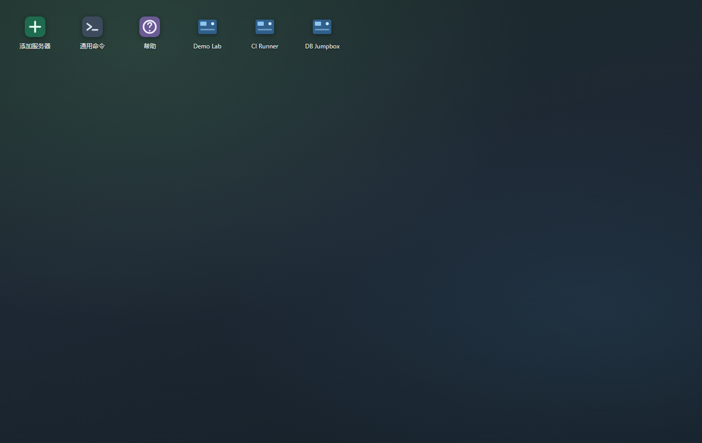
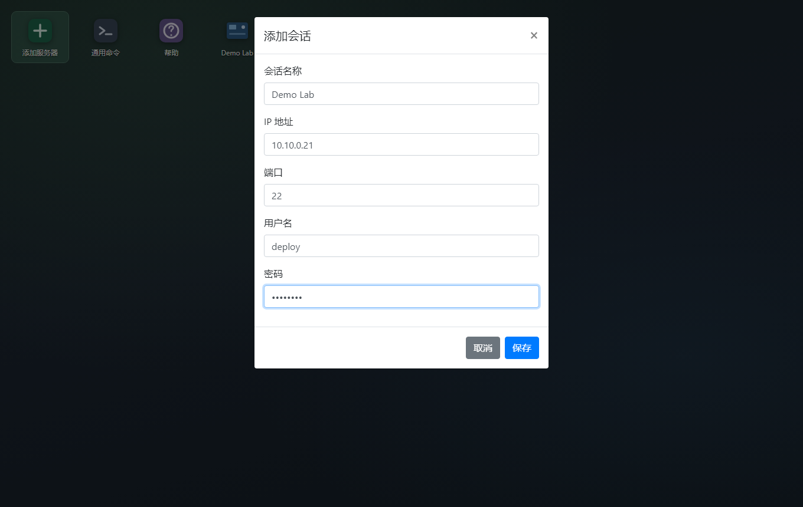
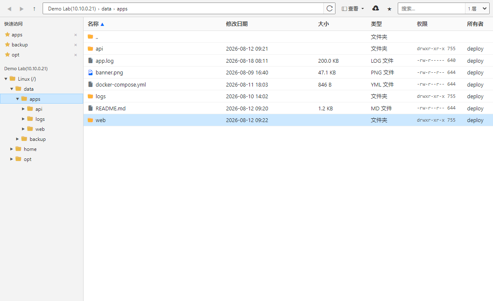
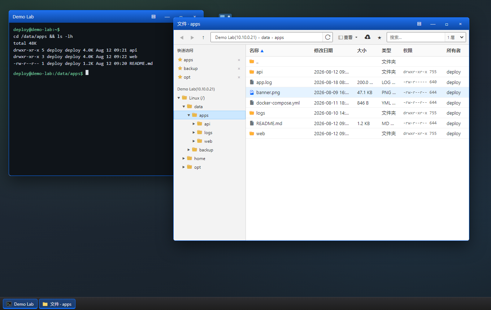
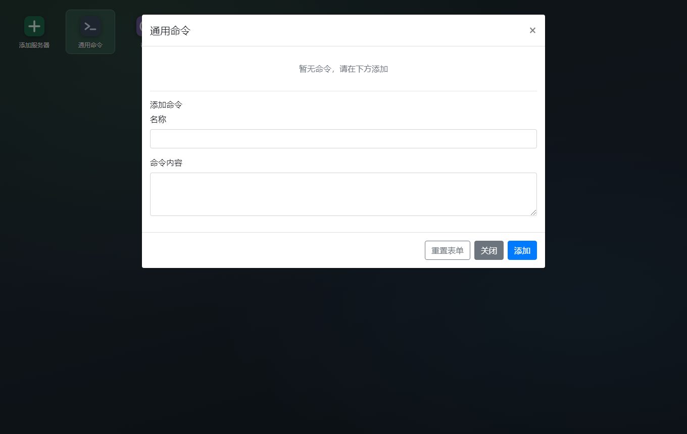
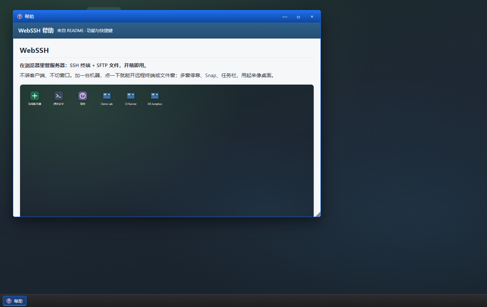
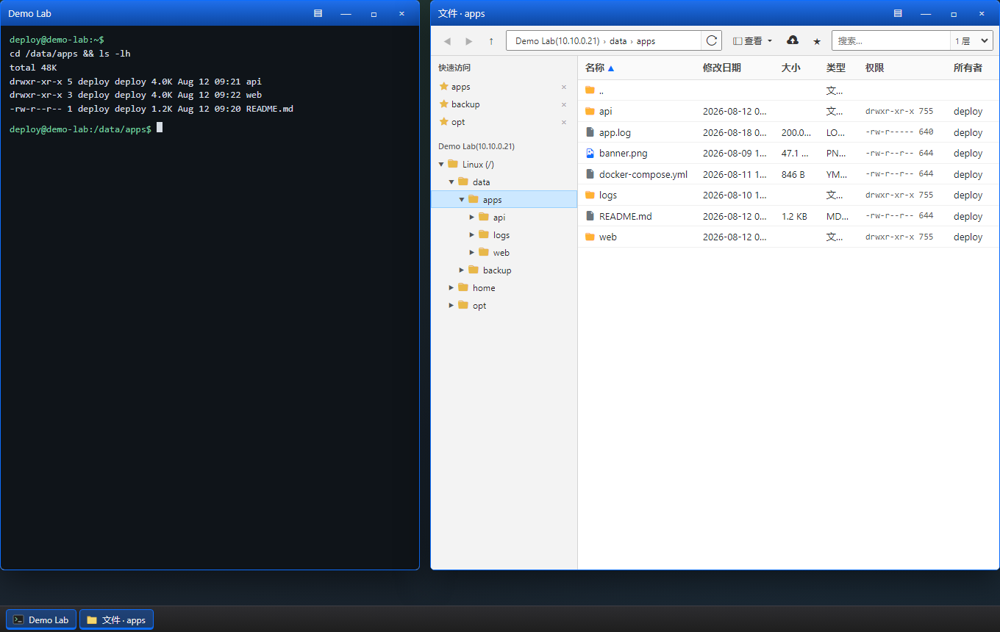
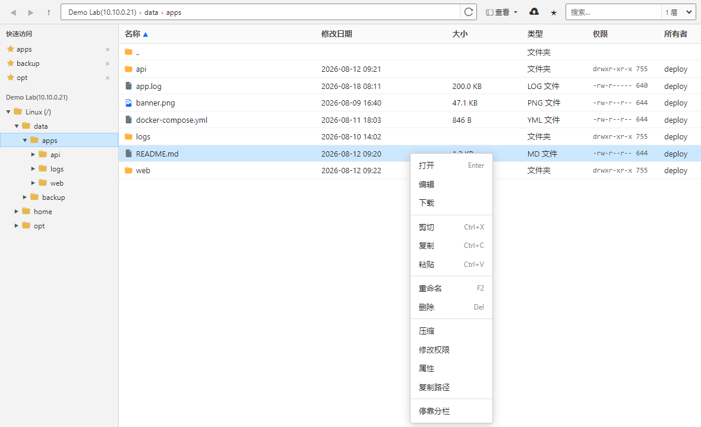
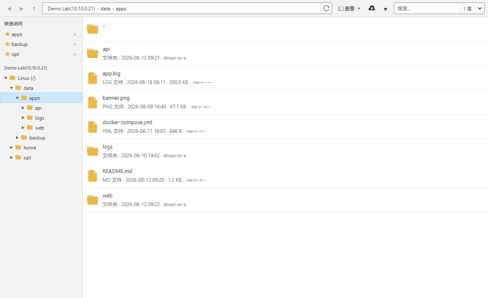

# WebSSH

**在浏览器里管服务器：SSH 终端 + SFTP 文件，开箱即用。**

不装客户端、不切窗口。加一台机器，点一下就能开远程终端或文件窗；多窗停靠、Snap、任务栏，用起来像桌面。



<p align="center">
  <a href="#快速开始">快速开始</a> ·
  <a href="#功能亮点">功能亮点</a> ·
  <a href="#怎么用">怎么用</a> ·
  <a href="#远程ssh详解">远程详解</a> ·
  <a href="#文件资源管理器详解">文件窗详解</a> ·
  <a href="#窗口布局详解">窗口布局</a> ·
  <a href="#命令库详解">命令库</a> ·
  <a href="#快捷键">快捷键</a> ·
  <a href="#安全注意">安全注意</a>
</p>

---

## 为什么选它

| | |
|---|---|
| **零客户端** | 浏览器打开就能连，适合跳板机 / 内网运维台 |
| **终端 + 文件一体** | SSH 与 SFTP 分窗并行；终端也可拖文件上传 |
| **类资源管理器** | 地址栏、目录树、收藏、多视图、悬浮详情、预览窗格 |
| **桌面化多窗** | 浮动、左侧停靠、边缘 Snap、布局板、任务栏；布局与目录会记住 |
| **命令库** | 通用 + 本机命令；侧栏一键发送 + IDEA 风格输入提示 |
| **好集成** | 独立运行，或 Spring Boot Starter / iframe 嵌入 |

---

## 功能亮点

### 桌面入口

一台服务器一个图标。单击 → **远程** / **文件**；右键 → 修改、删除、常用命令。


添加连接（下图为演示数据；当前仅支持 **密码登录**，无私钥表单）：



### 类 Windows 的文件窗

面包屑、快速访问、目录树、详细信息（含权限 / 所有者）：



大图标 + **悬浮详情**：


终端与文件并排：



### 通用命令库



### 应用内帮助

桌面点 **帮助** → 打开 **帮助浮动窗**（渲染本 README；已打开则聚焦；帮助窗 **不可停靠**）：



### 窗口与布局

- **▤ 左侧多列停靠** + 拖分割条调宽  
- **边缘 Snap**（半屏 / 四角）+ **布局板**（左右 / 上下 / 四格 / 左一右二）  
- **Snap Assist**、**任务栏**、**刷新恢复布局与文件目录**  



---

## 快速开始

```bash
cd tools/webssh   # 若在 monorepo 中
mvn spring-boot:run
```

浏览器打开：`http://localhost:9092/webssh/page/index.html`（默认端口 **9092**）

1. **添加服务器** → 保存  
2. 单击图标 → **远程** / **文件**  
3. 任务栏切换窗口；需要分栏时点标题栏 **▤**、拖到边缘，或悬停最大化用布局板  

发行包：`webssh.zip`（需 JDK）、`webssh_win64.zip` / `webssh_mac64.zip`（内置 JRE）。

---

## 怎么用

### 桌面

| 操作 | 说明 |
|------|------|
| 添加服务器 | 名称、IP、端口、用户名、**密码** |
| 通用命令 | 全局命令库 CRUD |
| 帮助 | 打开帮助浮动窗（读本 README） |
| 服务器 · 单击 | **远程** / **文件** |
| 服务器 · 右键 | 修改 / 删除 / 常用命令 |

开远程或文件时会校验登录态：过期则 **自动重新 login**，减少「会话已过期」打断。同端口多会话用归属标记，避免串用别人的连接。

### 远程 / 文件 / 命令（入口）

详见下文专章：**[远程 SSH 详解](#远程ssh详解)**、**[文件资源管理器详解](#文件资源管理器详解)**、**[命令库详解](#命令库详解)**、**[窗口布局详解](#窗口布局详解)**。

关闭浮动窗 **不会** 注销后台 SSH，也不会清除本地登录标记，可再开继续用。

---

## 远程（SSH）详解

### 基本能力

- xterm 终端，可用 vim、top、跟日志等全屏程序  
- 工具栏：**刷新连接**、**编码**、**主题**  
- 左侧 **快捷键面板**：搜索 +「全部 / 通用 / 本机」过滤，点击即发到终端  
- 面板与输入提示共用同一套命令数据  

### 编码与主题

| 项 | 选项 |
|----|------|
| 编码 | **UTF-8**（默认）、**GBK**；切换会同步到后端，减轻中文乱码 |
| 主题 | **暗黑**、**深蓝**、**白色**、**绿色**（记在浏览器本地） |

### 拖文件到终端上传

把本地文件 **拖进终端区域**，会上传到 **shell 当前工作目录**（通过 `/pwd` 探测）：

- 同名冲突：可 **重命名 / 替换 / 跳过**  
- 成功后有短提示  

不必先开文件窗也能丢配置、脚本上去。

### IDEA 风格命令提示

输入时根据通用 + 本机命令弹出候选：

| 行为 | 说明 |
|------|------|
| 匹配高亮 | 与当前输入重合的片段高亮 |
| 来源区分 | 本机项可带头像/图标，通用项对齐占位 |
| ↑ / ↓ | 选中候选（未选中前 Tab/回车不抢 shell） |
| Tab | 已选中 → 补全到终端（不回车）；未选中 → 交给 shell |
| 回车 | 已选中 → 补全并执行；未选中 → 正常回车（可触发自动收集） |
| Esc | 关闭提示 |
| 鼠标点选 | 直接套用该项 |
| IME | 中文输入法组字期间不误触发提示/收集 |
| 多行粘贴 | 按「收集行数」截断后可一次收集 |

### 关窗与重连

- 关窗只移除 UI，后台会话可保留  
- 再次打开会探测登录是否仍有效，失效则自动重登  

---

## 文件资源管理器详解

从桌面 → **文件** 打开。习惯上接近 Windows 资源管理器，同时面向 Linux 路径与权限。

### 整体布局

| 区域 | 作用 |
|------|------|
| 顶部导航 | 后退 / 前进 / 上级；面包屑；刷新；查看；上传；收藏；搜索 |
| 左侧 · 快速访问 | ★ 收藏目录（存在 **浏览器 localStorage**，非服务端） |
| 左侧 · 目录树 | 展开远程树；可把文件 **拖到树节点** 做复制/移动 |
| 中间列表 | 多视图；框选 / 多选 |
| 父页预览层 | 图片 / 视频 / 文本 / Excel 预览（盖在桌面上） |

窗口标题：根目录为 `会话名 (ip)`，进入子目录为 `会话名 (ip) · 末级名`。  
面包屑 / 树根文案为 `会话名(ip)`（不再叫「此电脑」）。

### 地址栏与导航

- 面包屑：`会话名(IP) › data › apps`  
- 单击地址栏空白编辑，**回车** 跳转，**Esc** 取消；**Ctrl+L** 聚焦  
- **Alt+← / →**、**Backspace / Alt+↑**  
- 首屏：URL 预置 `cwd` 优先；否则先 `/`，再异步对齐 shell pwd，**避免一上来进无权限的 `/root`**  
- 刷新页面尽量 **回到上次目录**（布局里会存每个文件窗的 `cwd`）  

### 查看方式

| 模式 | 说明 |
|------|------|
| 详细信息 | 名称、修改日期、大小、类型、权限、所有者；点表头排序 |
| 内容 | 左图标 + 右侧摘要行 |
| 平铺 / 大图标 / 超大图标 | 网格；图片缩略图；视频也可抽帧缩略（见下） |

- **Ctrl+滚轮**：详情 ↔ 图标缩放  
- **视图、排序、图标缩放** 会记在 `localStorage`  
- 图标视图下文件可带 **扩展名彩色角标**  

缩略图上限（约）：图片 **5MB**；视频抽帧 **80MB**。

### 悬浮详情

大图标 / 平铺 / 超大图标下悬停：名称、类型、修改日期、大小、权限等。

### 选择与重命名

- 空白处拖拽 **框选**；Ctrl 跳选；Shift 范围选  
- 单击 **已选中项的名称** 稍候可进入重命名（类资源管理器）  
- **F2** 重命名；**Ctrl+Z** 可撤销最近一次重命名（支持时）  

### 预览与在线编辑

| 类型 | 扩展名（摘要） | 预览上限（约） |
|------|----------------|----------------|
| 图片 | png / jpg / gif / webp / bmp / ico / svg | 8MB |
| 视频 | mp4 / webm / ogg / m4v / mov 等 | 512MB（支持 Range 拖进度） |
| 文本 | txt / log / md / json / xml / yaml / sh / py / js / java / … | 8MB |
| Excel | xlsx / xlsm / xls（浏览器 SheetJS 解析） | 5MB；最多约 500 行 × 50 列 |

- **双击** 或 **空格** 开关预览；**Esc** 关闭  
- **图片缩放**：滚轮放大/缩小（按鼠标位置）、拖拽平移、双击在「适应窗口 / 1:1」间切换；工具栏 `−` `+` `适应` `1:1`；快捷键 `+`/`-` 缩放、`0` 适应、`1` 原尺寸  
- **视频**：空格暂停/播放  
- **Excel**：只读表格，多 sheet 页签切换；过大或超行列会截断提示；**不支持**在线编辑写回  
- **编辑**：仅文本类；超约 8MB 拒绝；保存写回远程  
- **暂不支持**：PDF、DOC/DOCX（可下载后本地打开）  

### 上传 / 下载

- 工具栏上传，或拖进文件窗；也可拖到 **目录树节点** / 文件夹行  
- 进度弹层：**当前文件** + **合计**  
  - 阶段文案：**传到本机** → **写入远程**（服务端 NDJSON）  
- 同名冲突：**重命名 / 替换 / 跳过**  
- 右键下载  

### 剪贴板与拖拽

| 场景 | 行为 |
|------|------|
| Ctrl+C / X / V | 同会话复制 / 剪切 / 粘贴 |
| 同服务器拖拽 | 默认 **复制**；**Shift** = **移动** |
| 跨服务器拖到另一文件窗 | 仅 **复制**；服务端中转 |
| 跨服进度 | 「跨服务器复制」+ 当前文件字节 + 合计 + 约 N 个文件 |
| 同服复制撞名 | 自动 `name - 副本.ext` / `(2)`… |

### 压缩 / 权限 / 属性

| 功能 | 说明 |
|------|------|
| **压缩** | 右键压缩选中项；优先 **zip**，环境无 zip 则 **tar.gz**；可改归档名 |
| **修改权限** | 所有者 / 组 / 其他人 rwx 勾选，与八进制输入同步 |
| **属性** | 名称、类型、路径、大小、时间、权限、所有者、组等 |
| **复制路径** | 复制远程绝对路径 |

### 右键菜单

空白处：刷新、新建文件夹/文件、上传、粘贴、收藏、停靠分栏…  
选中项：打开、编辑、下载、剪切复制粘贴、重命名、删除、压缩、chmod、属性、复制路径…  



### 搜索

- 按文件名搜索；「层数」1–5 为向下递归深度（1 = 仅当前目录）  

### 其它反馈

收藏、剪贴板、压缩、保存等操作有短 **toast** 提示。

内容视图示意：



---

## 窗口布局详解

### 浮动窗

- 拖标题栏移动；**右下角**拖拽改尺寸  
- **标题栏双击** = 最大化 / 还原  
- 新窗 **级联错位** 打开，减少完全重叠  
- 标题按钮接近 Win11：最小化 / 最大化（还原）/ 关闭（悬停变红）  

### ▤ 左侧停靠

- 点标题栏 **▤**（或文件窗右键「停靠分栏」）进入左侧多列  
- 窗之间 **拖分割条** 调宽  
- 再点 ▤，或把标题栏拖出停靠区 → 恢复浮动  

### 边缘 Snap

- 拖到工作区 **左 / 右缘** → 半屏  
- 拖到 **四角** → 四分之一  
- 松手前有半透明预览  

### 布局板（悬停最大化）

悬停标题栏 **最大化** 约 0.3s，弹出 Win11 风格布局板：

| 模板 | 说明 |
|------|------|
| 左右 | 两列 |
| 上下 | 两行 |
| 四格 | 四等分 |
| 左一右二 | 左侧一整列 + 右侧上下两格 |

点击格子把当前窗放入对应槽位。

### Snap Assist

占槽后若还有空槽且存在其它已开窗，空区列出候选；点选填入；**Esc** 或点空白取消。

### 任务栏

- 浮动 / 停靠 / Snap 窗都会出现  
- 左键：聚焦 / 最小化  
- 右键：**还原 / 最小化 / 最大化 / 关闭**  

### 刷新后恢复

- 键名：`localStorage['webssh.sessionLayout.v1']`  
- 恢复：几何、dock / snap、**文件窗 cwd**、布局模板等  
- **已关闭的窗不会复活**；帮助窗不写入布局  

---

## 命令库详解

| 类型 | 入口 | 说明 |
|------|------|------|
| 通用命令 | 桌面「通用命令」 | 全会话共享；可维护名称 + 命令内容 |
| 本机命令 | 服务器右键 → 常用命令 | 按会话隔离 |

侧栏快捷键与终端输入提示都读：`/webssh/api/commands/for-session/{id}`。

### 本机命令 · 自动收集设置

在本机命令弹窗顶部可配置：

| 项 | 默认 | 范围 | 含义 |
|----|------|------|------|
| 自动收集 | 开 | 开/关 | 终端回车后是否写入本机命令 |
| 收集上限 | 1000 | 1–1000 | 超出则从尾部删最旧 |
| 收集行数 | 1 | 1–50 | 一次最多取前 N 行（多行粘贴时） |

规则摘要：

- 只写入当前会话，不进通用库  
- 与已有命令内容（trim）相同 → 更新时间并置顶，**不重复新增**  
- 输入密码 / token 前请先 **关闭自动收集**  

> 说明：种子文件 `static/webssh/data/dict.json` 可供通用命令初始化；若运行环境未自动导入，可在通用命令里手工添加。

---

## 快捷键

### 文件窗（焦点在文件区，且不在输入框）

| 快捷键 | 功能 |
|--------|------|
| F5 | 刷新 |
| F2 | 重命名 |
| Delete | 删除 |
| Enter | 打开 |
| Backspace / Alt+↑ | 上级 |
| Alt+← / Alt+→ | 后退 / 前进 |
| Ctrl+L | 编辑地址栏 |
| Ctrl+A | 全选 |
| Ctrl+C / X / V | 复制 / 剪切 / 粘贴 |
| Ctrl+Z | 撤销重命名（若可） |
| Ctrl+Shift+N | 新建文件夹 |
| 空格 | 预览开/关（视频预览时为暂停/播放） |
| Esc | 关菜单 / 预览 / 取消编辑 |
| 图片预览 · 滚轮 / + − | 放大缩小 |
| 图片预览 · 0 / 1 | 适应窗口 / 原始大小 |
| ↑ / ↓ | 移动选中 |
| Shift / Ctrl + 点击 | 范围选 / 跳选 |
| Shift + 拖拽 | 同服务器移动 |
| Ctrl + 滚轮 | 详情 ↔ 图标缩放 |
| Shift+F10 / 菜单键 | 右键菜单 |

地址栏：**回车** 跳转，**Esc** 取消。

### 桌面与窗口

| 快捷键 | 功能 |
|--------|------|
| Esc | 关桌面菜单；取消 Snap Assist |
| 标题栏双击 | 最大化 / 还原 |
| 任务栏右键 | 还原 / 最小化 / 最大化 / 关闭 |

### 终端

按键交给远程 Shell。命令提示：↑↓ 选中后再 Tab / 回车；也可鼠标点选。

---

## 技术栈

| 层 | 技术 |
|----|------|
| 后端 | Java、Spring Boot、WebSocket、JSch |
| 前端 | HTML / jQuery / Bootstrap、xterm.js |
| 数据 | 本地 JSON（`data/sessions.json`、`data/commands.json`） |

---

## 数据与 API（摘要）

| 文件 | 内容 |
|------|------|
| `data/sessions.json` | 会话（含密码，勿提交公开仓库） |
| `data/commands.json` | 通用 / 本机命令与收集设置 |
| `static/webssh/data/dict.json` | 通用命令种子 |

常用能力（均在 `/webssh/api/...` 下，终端另走 WebSocket）：

| 能力 | 说明 |
|------|------|
| sessions / commands | 会话与命令 CRUD、收集、按会话拉取 |
| loginSsh / checkLogin / pwd | 登录、探活、shell 当前目录 |
| ls / upload / download / preview | 列表；上传为 **NDJSON 进度流**；预览支持 Range |
| copy / move / crossCopy | 同机复制移动；跨机复制为 **NDJSON 进度流** |
| mkdir / touch / rename / rm | 新建目录/文件、重命名、删除 |
| chmod / compress / writeText | 权限、压缩、写文本 |

集成：

- 独立：`mvn spring-boot:run`，入口 `/webssh/page/index.html`  
- iframe：嵌入上述页面（或单独 `ssh.html` / `sftp.html`）  
- Starter：引入依赖后挂载静态资源与 WebSocket（以你的发行说明为准）  

---

## 安全注意

1. 会话密码明文存在本地 JSON，**仅建议内网或本机**；当前 UI **仅密码认证**  
2. 开启回车自动收集时，键入内容可能入库 → 输密码前请关闭  
3. 不要把 `data/` 推到公开仓库，也不要裸奔公网  
4. 服务端会对危险远程路径做校验（如非法路径、目录拷进自身子路径等）  

README 截图均为演示数据（`Demo Lab` / `10.10.0.21` 等）。

---

## 常见问题

**未登录或会话已过期**  
服务重启后内存态清空。关掉窗再从桌面打开即可；新版本开窗前会探测并 **自动重登**。

**列出目录 Permission denied**  
账号对该路径无权限。换到有权限的目录；刷新应回到上次路径，而不是硬进 `/root`。

**布局刷新后没了**  
确认未清站点数据（键名 `webssh.sessionLayout.v1`）；已关闭的窗不会恢复。

**终端拖文件没反应**  
需已成功连上远程；文件会传到 shell **当前目录**（不是固定 `/root`）。

---

## 后续方向

- Go 版本  
- 前端 Vue3 + Vite  

---

## 许可

见 [LICENSE](LICENSE)。

截图：`node scripts/capture-readme-shots.cjs`（需本地服务已启动；使用演示数据与 Mock API）。
